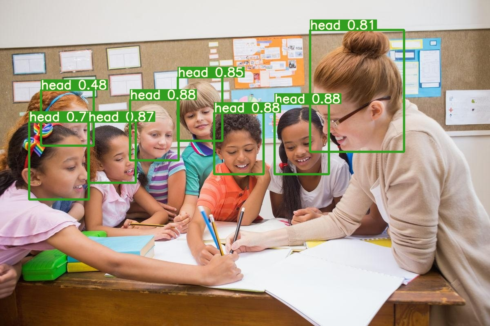

# Obj_detect
colab link

https://colab.research.google.com/drive/1rb31kZxGgrpLvJHxW7BeYE1-kF5FnbbH?usp=sharing

Data set is from https://public.roboflow.com/object-detection/hard-hat-workers 

create an account in 
[ROBOFLOW](https://public.roboflow.com/) to use datasets,get the code and paste that link.
 
 `!curl -L "your link" > roboflow.zip; unzip roboflow.zip; rm roboflow.zip`
 
 
 [yolov5](https://github.com/ultralytics/yolov5) GIT repo
 
 
# Dataset

# mAP,precision,recall

# Results

